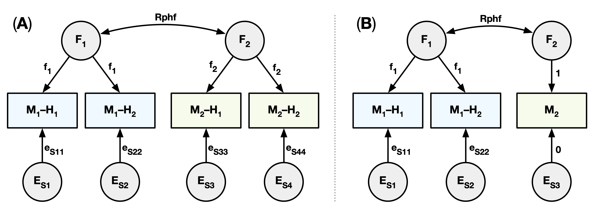

# Reliability modelling
## Table of contents
- [General Introduction](#general-introduction)
- [Reliability modelling](#reliability-modelling)
	* [Introduction to the measurement model](#Introduction to measurement model)
	* [The measurement model script](#the-measurement-model-script)
	* [Example usage of a measurement model](#example-usage-of-a-measurement-model)
- [Acknowledgement](#acknowledgement)
- [References](#references)

## General introduction

The main mantra of Classical Test Theory is that "any measurement is fallible" and states that unreliable measurements can result from various sources of error, including sampling bias, systemic bias, and random measurement error \[[1](#references),[2](#references)\]. Even measurements that are considered to be highly robust to measurement error, such as body height, can be affected by errors or biases in the measurements, especially in longitudinal study designs when different measurement instruments might be used on each occasion or when the constructs were measured and recorded by different raters. Measurement error attenuates the correlation coefficient between two variables, resulting in a lower _observed_ correlation than is truly present \[[3](#references)\]. To counteract this attenuation, Spearman proposed a disattenuation correction based on the reliability of the two variables to obtain the "true" association in the absence of any random error in the measurements of the variables. However, classical disattenuation relies on a correction factor that needs to be known a priori and scales with the reliability of the measurements. Consequently, a single fixed correction factor might not generalize well to other samples and is at risk of overcorrecting the strength of the "true" association \[[4](#references)\]. Instead of the classical disattenuation correction, a measurement model can obtain a latent factor that represents the reliable component of a construct based on two or more parallel scores without the need of an a priori correction factor \[[5](#references),[6](#references),[7](#references)\].

## Reliability modelling
### Introduction
A measurement model can be used to derive a "true" estimate of a variable as if the measurements were free of random measurement error that can then be used to obtain a _corrected_ association with another construct \[[5](#references),[6](#references),[7](#references)\]. The "true" estimate is modelled in a structural equation model by a latent variable that explains a certain proportion of the variation that all repeated measurements of the same construct have in common (i.e. the reliable component). Any residual variance that is not shared between the measurements is then considered to be due to random measurement error (**Figure 1**).


**Figure 1.** Two measurement models in a 2–2 (**A**) and 2–1 (**B**) configuration. Latent factors `F*` explain part of the variation in repeated measurements `Mx–Hy` with any residual variance considered to be measurement-specific error terms `Es*`.

### The measurement model script
The [MeasurementModel.r](./MeasurementModel.r) script provides a customizable measurement model for estimating the "true" association between latent factors of different constructs. By default, the model is in a 2–1 configuration that estimates a reliable latent factor `F1` for the two parallel scores `M1-H1` and `M1-H2` for measure `M1` and a second latent factor `F2` for the single full score of measure `M2` (**Figure 1B**). The model can be configured for any number of latent factors and number of measurements by changing the parameters in the _measurement model parameters_ section of the script; for example, in a 2–2 configuration (**Figure 1A**) to apply a measurement model to both constructs independently. In this example we will use the 2–1 configuration that was used in _Teeuw et al., in review_ \[[8](#references)\].

There is a number of relevant parameters estimated by the measurement model. The *uncorrected association between measurements* is stored in the `Rphm` matrix; e.g. `Rphm[1,3]` is the uncorrected association between parallel score `M1–H1` and the full score of the second measure `M2`. The same `Rphm` matrix also stores the *internal test-retest reliability between parallel scores*; e.g. `Rphm[1,2]` is the test-retest reliability between the parallel scores `M1–H1` and `M1–H2` of measure `M1`.

The *corrected association between the two constructs* (or association between the latent factors of the measures) is stored in the `Rphf` matrix; e.g `Rphf[1,2]` is the corrected association between the two measures `M1` and `M2` (or the association between the two latent factors `F1` and `F2`).

The *standardized factor loadings* that determine the proportion of variation in the individual measurements that is explained by their respective latent factor are stored in the `Fs_std2` matrix; e.g. `Fs_std2[2,1]` stores the proportion of variance in the parallel score `M1–H2` that is explained by the latent factor `F1`.

### Example usage of a measurement model
In this example we will review the measurement model in a practical application where the reliable component of functional connectivity between brain regions is estimated from split-session half-score estimates of functional connectivity and its "true" association with behavior is revealed; see _Teeuw et al., in review_ \[[8](#references)\] and _Teeuw et al., NeuroImage 2019_ \[[9](#references)\] for applications of a measurement model to actual research data.

**Applying the measurement model to the example data**
First, we load the OpenMx package and the example data in the R environment with:
```R
045  require(OpenMx)
...
054  data_df <- readRDS("ExampleData.rds")
055  selVars <- c("FC_Z_H1", "FC_Z_H2", "BHV")
```
The example data frame `data_df` contains the full score functional connectivity measure `FC_Z`, the two split-session parallel half-scores `FC_Z_H1` and `FC_Z_H2` derived from the same resting-state fMRI scan as `FC_Z` by splitting the BOLD signal time series into two equal halves, and a behavioral measure `BHV`. We will be using the two half-score measure of functional connectivity and the behavior measure in this example. Note that the order of the variables defined in `selVars` matters. See _Teeuw et al., in review_ \[[8](#references)\] for more detail on this split-session approach for resting-state functional connectivity.

The means and (co)variances between the variables are computed because these can be used for the initialization of the parameters of the models:
```R
063  init_means <- apply(data_df[,selVars, drop=F], 2, mean, na.rm=T)
...
069  init_corrs <- cor(data_df[,selVars, drop=F], method="pearson", use="pairwise.complete.obs")
```

Next, we set up the parameters for a measurement model in a 2–1 configuration. We can leave most of the default parameters in this script:
```R
077  nf=2
078  nv=3
...
108  init_means_labels = c("mean_FC_Z", "mean_FC_Z", "mean_BHV")
```
The covariances between the latent factors and the factor loadings only require a rough estimate, and can be initialized with values from the means and (co)variances of the measurements computed previously. In this example, the two parallel half-scores were derived from the same construct (in this case, the same resting-state functional MRI scan) within short time interval of one another, so it is highly probably that means and variances should be about equal. We therefore constrain the means of the two parallel half-scores of the functional connectivity estimates to be equal by setting their labels to the same value `"mean_FC_Z"` (_line 108_), and do the same for the loadings of factor `F1` on the two half-scores with the label `"f1"` (_line 97_). The loadings of factor `F2` have been fixed to `1.00` (_line 94_ and _line 96_) since we only have a single full-score measurement of the behavioral construct. Similarly, the residual variance for the behavioral measure has been fixed to `0.00` (_line 102_ and _line 103_). 

These parameters for the specification of the measurement model are then used to construct the structural equation model in the OpenMx package \[[10](#references),[11](#references)\]:
```R
116  MeasurementModel <- mxModel("mm",
...
168  ) # END of mxModel MeasurementModel
```
This will create an instance of the model in memory that specifies the relationship between the variables, how the model should be fit to the data, and requests confidence intervals for specific variables. The objective of the measurement model is to decompose the variance of the individual measurements `Vm` into a proportion `fs` explained by the variance in the factor(s) `Vf` common to the measurements that the factor(s) load onto, plus measurement-specific residual variances `Es` that will be considered "noise": `Vm = fs %&% Vf + Es` (_line 135_). Note that at this point, the model has not yet been fit to the data.

As a safety precaution, we added the following line of code: 
```R
171  MeasurementModel <- omxAssignFirstParameters(MeasurementModel)
```
This will ensure that any variables that share a common label, for example the means of the two parallel scores `FC_Z_H1` and `FC_Z_H2` that were constrained to be equal, are initialized with the same value. Otherwise, you might see an error message "`ERROR: The free parameter '__X__' has been assigned multiple starting values!`" when trying to fit the measurement model.

Finally, the measurement model can be fit to the data with:
```R
178  MeasurementModelFit <- mxTryHard(MeasurementModel, extraTries=30, checkHess=F, intervals=T, silent=T)
```

**Examing the output from the measurement model**
A summary of the model fit and the estimated parameters can be obtained with:

```R
186  print(summary(MeasurementModelFit))
```
> **_Output:_**
> ```
> Summary of mm 
> free parameters:
>      name   matrix row     col      Estimate  Std.Error A lbound ubound
> 1  covF12       Vf   2       1 -3.048567e-01 0.09148734       -1      1
> 2      f1       fs   1       1  5.407564e-01 0.06151578        0       
> 3     es1       es   1       1  8.254852e-01 0.05221737        0       
> 4     es2       es   2       2  8.501396e-01 0.05230631        0       
> 5 mean_M1 expMeans   1 FC_Z_H1  6.444058e-03 0.05144630                
> 6 mean_M2 expMeans   1     BHV -5.609232e-08 0.06414995                
> 
> confidence intervals:
>                     lbound   estimate      ubound note
> mm.Fs_std2[1,1]  0.1765074  0.3002716  0.42438269     
> mm.Fs_std2[2,1]  0.1701610  0.2880521  0.40491178     
> mm.Rphf[2,1]    -0.4821701 -0.3048567 -0.12056757     
> mm.Rphm[2,1]     0.1751279  0.2940984  0.40459997     
> mm.Rphm[3,1]    -0.2656852 -0.1670525 -0.06546361     
> mm.Rphm[3,2]    -0.2571251 -0.1636181 -0.06502314     
> 
> Model Statistics: 
>                |  Parameters  |  Degrees of Freedom  |  Fit (-2lnL units)
>        Model:              6                    723              2032.552
>    Saturated:              9                    720                    NA
> Independence:           6                    723                    NA
> Number of observations/statistics: 243/729
> 
> Information Criteria: 
>       |  df Penalty  |  Parameters Penalty  |  Sample-Size Adjusted
> AIC:       586.5524               2044.552                 2044.908
> BIC:     -1938.9310               2065.511                 2046.492
> To get additional fit indices, see help(mxRefModels)
> timestamp: 2020-08-19 11:15:55 
> Wall clock time: 0.1705182 secs 
> optimizer:  CSOLNP 
> OpenMx version number: 2.11.5 
> Need help?  See help(mxSummary)  
> ```

The individual parameters of the model can then be inspected by accessing the output of the model fit `MeasurementModelFit$output`. The following lines of code print the most relevant parameters:
```R
189  message(sprintf("Corrected reliable association between the two constructs = %0.3f [%0.3f; %0.3f]", MeasurementModelFit$output$algebras$mm.Rphf[1,2], MeasurementModelFit$output$confidenceIntervals["mm.Rphf[1,2]","lbound"], MeasurementModelFit$output$confidenceIntervals["mm.Rphf[1,2]","ubound"]))
...
200  message(sprintf("Association between the second parallel score of the first construct and second construct = %0.3f [%0.3f; %0.3f]", MeasurementModelFit$output$algebras$mm.Rphm[2,3], MeasurementModelFit$output$confidenceIntervals["mm.Rphm[2,3]","lbound"], MeasurementModelFit$output$confidenceIntervals["mm.Rphm[2,3]","ubound"]))
```
Note that this part of the code is specific for printing the releveant parameters of a measurement model in a 2–1 configuration. The output for this example should look like this:
> **_Output:_**
> ```
> Corrected association between the two constructs = -0.305 [-0.482; -0.121]
> Standardized factor loading on first parallel score = 30.0% [17.7%; 42.4%]
> Standardized factor loading on second parallel score = 28.8% [17.0%; 40.5%]
> Test-retest reliability between the two parallel scores = 0.294 [0.175; 0.405]
> Uncorrected association between the first parallel score and second construct = -0.167 [-0.266; -0.065]
> Uncorrected association between the second parallel score and second construct = -0.164 [-0.257; -0.065]
> ```

About `30%` of the variation in the parallel half-score measures of functional connectivity `FC_Z_H1` and `FC_Z_H2` is explained by the reliable factor `F1`, with the 95% confidence interval ranging between `17%` and `42%`. This is closely reflected by the internal test-retest reliability of `0.294` between the two half-scores. After correction for random measurement error in functional connectivity, the reliable component of functional connectivity `F1` is negatively and moderately associated with the behavior `BHV` at `-0.305`. In contrast, before correction, the two half-score measures of functional connectivity are only weakly associated with the behavioral measure at `-0.167` and `-0.164`.

In this example we used two split-session half-score estimates instead of two parallel full-scores to obtain a reliable component of functional connectivity. The reliability of functional connectivity is known to increase with longer scan duration \[[12](#references),[13](#references)\]. The reduction in reliability from using the shorter split-session half-score estimates of functional connectivity can therefore negatively affect the association strength with the behavioral measure. In this example, we therefore calculate the _uncorrected_ association between the full score measure of functional connectivity `FC_Z` and the full score measure of behavior `BHV` manually:
```R
> cor.test(data_df$FC_Z, data_df$BHV, method="pearson")
```
> **_Output:_**
> ```
>   Pearson's product-moment correlation
> 
> data:  data_df$FC_Z and data_df$BHV
> t = -3.222, df = 241, p-value = 0.001449
> alternative hypothesis: true correlation is not equal to 0
> 95 percent confidence interval:
>  -0.32085332 -0.07940031
> sample estimates:
>        cor 
> -0.2032142 
> ```

As expected, the _uncorrected_ association of the full-score functional connectivity estimate is slightly stronger associated with the behavioral measure at `-0.203` than either of the two half-scores. Using the full-score provides a fairer "comparison" between the observed _uncorrected_ association and the "true" _corrected_ association. Nevertheless, the "true" _corrected_ association between functional connectivity and the behavioral measure in the absence of random measurement error on the functional connectivity estimate is in reality still ~1.5x stronger than the observed association of the full-score functional connectivity estimate with the behavioral measure.

**Determining the goodness of fit**
Any model can be fit to the data, so we still need to determine if the measurement model is actually a good description of the data. We therefore calculate three of the commonly used goodness of fit indices: Comparative Fit Index (CFI), Tucker-Lewis Index (TLI), and the Root-Mean-Square Error of the Approximation (RMSEA) \[[14](#references)\]. These indices require two additional models for comparison: a saturated and an independence (or null) model. At one end of the spectrum, the saturated model is a fully unconstrained model where all means, variances and covariances of the variables are estimated freely. At the other end of the spectrum, the independence model assumes that all measures are independent and therefore only the means and variances are freely estimated and all covariances between variables are constrained to zero (i.e. a diagonal matrix as covariance matrix; _line 231_). The same constraints on means of the variables are used to ensure the null model is properly nested within the measurement model \[[15](#references)\]. The goodness of fit indices is computed with:

```R
207  SaturatedModel <- mxModel("sat",
...
252  message(sprintf("Goodness of fit indices are CFI=%0.3f, TLI=%0.3f, and RMSEA=%0.3f", tmp_summary$CFI, tmp_summary$TLI, tmp_summary$RMSEA))
```
> **_Output:_**
> ```
> Goodness of fit indices are CFI=0.986, TLI=0.981, and RMSEA=0.025
> ```

This suggest that for this example the measurement model is a good fit to the data, with CFI>0.95 and RMSEA<0.05. Model fits with a CFI>0.90 and RMSEA<0.08 would otherwise also have been acceptable fits \[[16](#references)\].

**Limitations of a measurement model**
There are a couple of limitations to be considered when applying reliability modelling to your data \[[17](#references)\]. Firstly, the corrected and uncorrected associations cannot be directly compared because they measure slightly different constructs (i.e. the reliable portion of variation versus the full variation). However, it is good practice to report both the corrected and uncorrected associations, and to include the goodness of fit indices that determine how well the model describes the data. Secondly, measurement model does not change the quality of the data, and should therefore not be used as a substitute to obtain good and reliable measurements. Finally, the corrected association does not yield better predictive power than the uncorrection association, and neither will it provide more significant results. The ultimate purpose of a measurement model is to obtain estimates that are closer to the true value that would have been in the absence of random error in the measurements.

## Acknowledgements
This work was supported by the Consortium on Individual Development (CID; [individualdevelopment.nl](https://www.individualdevelopment.nl/) and Biobanking and BioMolecular resources Research Infrastructure in The Netherlands (BBMRI-NL 2.0; [bbmri.nl](https://www.bbmri.nl/)).

## References
1. Streiner, D.L. (2003). "_Starting at the Beginning: An Introduction to Coefficient Alpha and Internal Consistency_”. Journal of Personality Assessment, vol. 80(1), p. 99–103. [doi:10.1207/s15327752jpa8001_18](https://dx.doi.org/10.1207/s15327752jpa8001_18)
2. Miller, M.B. (1995). "_Coefficient alpha: A basic introduction from the perspectives of classical test theory and structural equation modeling_”. Structural Equation Modeling: A Multidisciplinary Journal, 2(3), 255–273. [doi:10.1080/10705519509540013](https://dx.doi.org/10.1080/10705519509540013)
3. Spearman, C. (1904). “_The Proof and Measurement of Association between Two Things_”. The American Journal of Psychology, vol. 15(1), p. 72–101. [doi:10.2307/1412159](https://dx.doi.org/10.2307/1412159)
4. Leigh Wang, L. (2010). “_Disattenuation of Correlations Due to Fallible Measurement_”. Newborn and Infant Nursing Reviews, vol. 10(1), p. 60–65. [doi:10.1053/j.nainr.2009.12.013](https://dx.doi.org/10.1053/j.nainr.2009.12.013)
5. Bollen, K.A., Noble, M.D. (2011). “_Structural equation models and the quantification of behavior_”. Proceedings of the National Academy of Sciences, vol. 108, p. 15639–15646. [doi:10.1073/pnas.1010661108](https://dx.doi.org/10.1073/pnas.1010661108)
6. Cooper, S.R., Jackson, J.J., Barch, D.M., Braver, T.S. (2019). “_Neuroimaging of Individual Differences: A Latent Variable Modeling Perspective_”. Neuroscience and Biobehavioral Reviews, vol. 98, p. 29–46. [doi:10.1016/j.neubiorev.2018.12.022](https://dx.doi.org/10.1016/j.neubiorev.2018.12.022)
7. Brandmaier, A.M., Wenger, E., Bodammer, N.C., Kühn, S., Raz, N., Lindenberger, U. (2018). “_Assessing reliability in neuroimaging research through intra-class effect decomposition (ICED)_”. eLife, vol. 7, e35718. [doi:10.7554/elife.35718](https://dx.doi.org/10.7554/elife.35718)
8. Teeuw, J., Boomsma, D.I., Hulshoff Pol, H.E., Brouwer, R.M. (in review). “_Reliability modelling of resting-state functional connectivity_”.
9. Teeuw, J., Brouwer, R.M., Guimarães, J.P.O.F.T., Brandner, P., Koenis, M.M.G., Swagerman, S.C., Verwoert, M., Boomsma, D.I., Hulshoff Pol, H.E. (2019). “_Genetic and environmental influences on functional connectivity within and between canonical cortical resting-state networks throughout adolescent development in boys and girls_”. NeuroImage, vol. 202, 116073. [doi:10.1016/j.neuroimage.2019.116073](https://dx.doi.org/10.1016/j.neuroimage.2019.116073)
10. Neale, M.C., Hunter, M.D., Pritikin, J.N., Zahery, M., Brick, T.R., Kirkpatrick, R.M., Estabrook, R., Bates, T.C., Maes, H.H., Boker, S.M. (2016). “_OpenMx 2.0: Extended structural equation and statistical modeling_”. Psychometrika, vol. 81(2), p. 535–549. [doi:10.1007/s11336-014-9435-8](https://dx.doi.org/10.1007/s11336-014-9435-8)
11. OpenMx structural equation modelling package for the R statistical framework. website: https://openmx.ssri.psu.edu
12. Birn, R.M., Molloy, E.K., Patriat, R., Parker, T., Meier, T.B., Kirk, G.R., Nair, V.A., Meyerand, M.E., Prabhakaran, V. (2013). “_The effect of scan length on the reliability of resting-state fMRI connectivity estimates_”. NeuroImage, vol. 83, p. 550–558. [doi:10.1016/j.neuroimage.2013.05.099](https://dx.doi.org/10.1016/j.neuroimage.2013.05.099)
13. Noble, S., Scheinost, D., Constable, R.T. (2019). “_A decade of test-retest reliability of functional connectivity: A systematic review and meta-analysis_”. NeuroImage, vol. 203, 116157. [doi:10.1016/j.neuroimage.2019.116157](https://dx.doi.org/10.1016/j.neuroimage.2019.116157)
14. Cangur, S., Ercan, I. (2015). “_Comparison of Model Fit Indices Used in Structural Equation Modeling Under Multivariate Normality_”. Journal of Modern Applied Statistical Methods, vol. 14(1), p. 152–167. [doi:10.22237/jmasm/1430453580](https://dx.doi.org/10.22237/jmasm/1430453580)
15. Widaman, K.F., Thompson, J.S. (2003). “_On Specifying the Null Model for Incremental Fit Indices in Structural Equation Modeling_”. Psychological Methods, vol. 8(1), p. 16–37. [doi:10.1037/1082-989x.8.1.16](https://dx.doi.org/10.1037/1082-989x.8.1.16)
16. Hu, L., Bentler, P.M. (1999). “_Cutoff criteria for fit indexes in covariance structure analysis: Conventional criteria versus new alternatives_”. Structural Equation Modeling: A Multidisciplinary Journal, vol. 6(1), p. 1–55. [doi:10.1080/10705519909540118](https://dx.doi.org/10.1080/10705519909540118)
17. Muchinsky, P.M. (1996). “_The Correction for Attenuation_”. Educational and Psychological Measurement, vol. 56(1), p. 63–75. [doi:10.1177/0013164496056001004](https://dx.doi.org/10.1177/0013164496056001004)

